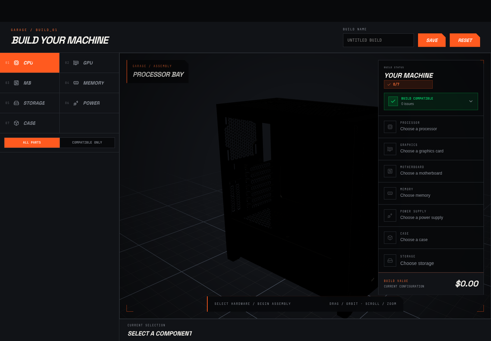
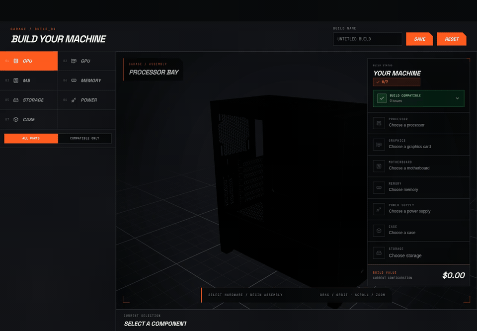
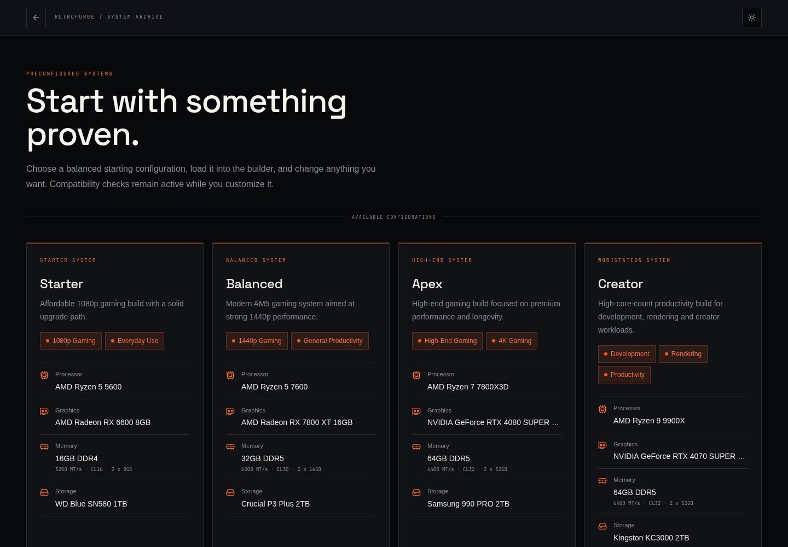
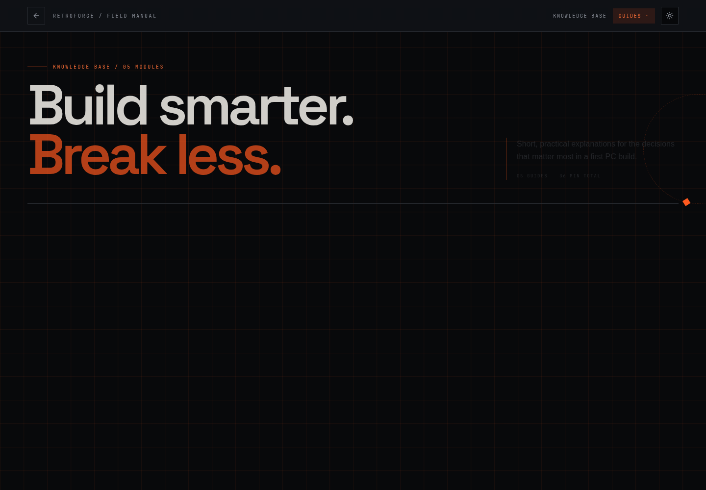
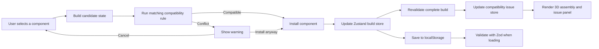

# RetroForge

<p align="center">
  <strong>Build a PC that fits together before buying a single part.</strong>
</p>

<p align="center">
  RetroForge is an interactive 3D PC configurator that combines a component catalogue,
  compatibility-aware recommendations, and a visual assembly workspace.
</p>

<p align="center">
  <a href="https://retroforge-iota.vercel.app/"><strong>Open the live app</strong></a>
  ·
  <a href="#run-it-locally">Run locally</a>
  ·
  <a href="#roadmap">Roadmap</a>
</p>

<p align="center">
  
  
  
  
  
  
  
</p>



## Product tour

The tour moves through the 3D builder, the preconfigured systems, and the component guides.

[](./docs/media/retroforge-tour.mp4)

> Click the animation to open the MP4 version. The current deployment is an active work in progress, so some catalogue data, models, and rules are still being expanded.

## What RetroForge does

- Builds a PC from CPU, GPU, motherboard, memory, storage, power supply, and case categories.
- Renders the selected hardware inside an interactive Three.js scene with orbit and zoom controls.
- Checks a candidate part before installation and can filter the catalogue to compatible parts only.
- Warns before an incompatible part is installed, while still letting the user continue intentionally.
- Turns failed rules into a compatibility panel with a simple explanation, detailed values, and a clickable suggested action.
- Saves named builds in the browser and validates them before loading them again.
- Loads preconfigured starter, balanced, high-end, and workstation systems into the same builder.
- Includes beginner-friendly guides that explain what the major PC components do.
- Supports responsive desktop and mobile build controls plus light and dark themes.

## Screenshots

### Compatibility-aware 3D builder


### Preconfigured systems



### Component guides



## How it works



The rule engine is deliberately separate from the UI:

1. `buildWithCandidate` creates a temporary build containing the part the user is considering.
2. `buildToComponents` adapts the keyed `BUILD` object into a flat list the engine can check.
3. `compatibilityEngine` selects the rule for each source component and compares it with the relevant target.
4. `getDetailedErrors` keeps only failed checks that include user-facing error information.
5. The build page either installs immediately, filters the candidate out, or opens the “install anyway” warning.
6. After every change, the issue store is refreshed and the viewport renders the current result.

Current rule coverage includes:

| Source and target | Check |
| --- | --- |
| CPU ↔ motherboard | Socket match |
| RAM ↔ motherboard | DDR generation match |
| GPU ↔ case | GPU length clearance |
| Storage ↔ motherboard | Connector, slot, and protocol support |
| PSU ↔ GPU | Wattage headroom |
| Case ↔ motherboard | Form-factor fit |

CPU/socket, RAM/type, and GPU/clearance checks currently produce the richest detailed errors. Expanding the remaining rules to the same structured error format is part of the roadmap.

## Where Zustand is used

Zustand keeps shared builder state outside individual React components without introducing reducers, providers, or a larger state framework.

| Store | File | Responsibility |
| --- | --- | --- |
| Build store | [`src/stores/BuildStore.ts`](./src/stores/BuildStore.ts) | Holds the active `BUILD`, replaces a loaded build, and updates one category at a time. |
| Compatibility issue store | [`src/stores/ComptiblityIssuesStore.ts`](./src/stores/ComptiblityIssuesStore.ts) | Holds the current `DetailedErrors[]`, supports functional updates, and clears stale issues when a saved or prebuilt system is loaded. |
| Sidebar store | [`src/stores/expandedCategory.ts`](./src/stores/expandedCategory.ts) | Shares the open component category so suggested actions can take the user directly to the relevant catalogue section. |

The main consumers are [`BuildPage.tsx`](./src/Pages/BuildPage.tsx), which coordinates selection and installation, and [`BuildViewport.tsx`](./src/components/BuildViewport.tsx), which reads the current issues and displays the status panel.

## Where Zod is used

TypeScript protects data while the app is compiling; it cannot prove that JSON already stored in a browser still has the right shape. Zod handles that runtime boundary.

All part schemas live in [`src/zod/buildSchema.ts`](./src/zod/buildSchema.ts):

- `basePartSchema` validates fields shared by every catalogue item.
- CPU, GPU, RAM, PSU, case, motherboard, and storage schemas validate category-specific properties.
- `installedDriveSchema` validates each storage instance.
- `buildSchema` validates one complete or in-progress build.
- `savedBuildSchema` adds the saved build ID and name.
- `savedBuildListSchema` validates the full array read from `localStorage`.

When [`BuildPage.tsx`](./src/Pages/BuildPage.tsx) starts, it parses `retroforge.savedBuilds` with `savedBuildListSchema.safeParse(...)`. Valid data is loaded; malformed or outdated data is rejected instead of being trusted and crashing the builder later.

## Tech stack

| Area | Technology | Why it is here |
| --- | --- | --- |
| UI | React 19 + TypeScript | Component-driven interface with compile-time safety. |
| Build tooling | Vite 8 | Fast development server, optimized production build, and route-level lazy loading. |
| Styling | Tailwind CSS 4 | Responsive utility styling for the industrial dashboard design. |
| 3D | Three.js, React Three Fiber, Drei | WebGL rendering, camera controls, loading helpers, environment lighting, and GLB models. |
| State | Zustand | Small shared stores for the build, issue list, and open category. |
| Validation | Zod | Runtime validation for saved browser data. |
| Routing | React Router | Home, builder, prebuilt, and guide routes in a static-host-friendly hash router. |
| Motion | Motion + GSAP | Page, dialog, panel, and installation animation. |
| UI primitives | Base UI, Lucide, Hugeicons, Tabler Icons, Sonner | Accessible primitives, iconography, and toast feedback. |
| Deployment | Vercel | Hosts the client application. |

## Project structure

```text
src/
├── Logic/Compatibility/      # Rules, build validation, and candidate checks
├── Pages/
│   ├── build/                # Builder-specific desktop/mobile UI pieces
│   ├── BuildPage.tsx         # Builder coordinator
│   ├── Home.tsx              # Landing page
│   ├── PreBuilts.tsx         # Preconfigured systems
│   └── Guide*.tsx            # Guide listing and detail pages
├── components/               # 3D viewport, PC assembly, navigation, shared UI
├── data/                     # Typed component catalogue and prebuilt data
├── models/                   # React components for 3D assets
├── stores/                   # Zustand stores
├── zod/                      # Runtime persistence schemas
├── App.tsx                   # Lazy routes and application shell
└── main.tsx                  # React entry point

public/models/                # GLB hardware models
docs/media/                   # README screenshots and product tour
```

## Run it locally

### Prerequisites

- Node.js 20.19+ (or a newer supported LTS release)
- npm

### Setup

```bash
git clone https://github.com/Nihar-potdar/3D-Pcpartpicker.git
cd 3D-Pcpartpicker
npm install
npm run dev
```

Vite will print the local URL in the terminal. Open it in a browser and choose **Start Build**.

### Useful commands

```bash
npm run dev      # start the development server
npm run build    # type-check and create the production bundle
npm run lint     # run ESLint
npm run preview  # preview the production build locally
```

## Roadmap

- [ ] Return structured, user-facing errors from every compatibility rule.
- [ ] Add CPU cooler, fan, and radiator clearance checks.
- [ ] Calculate full-system power draw instead of GPU-only PSU headroom.
- [ ] Model slot counts and conflicts for RAM, M.2 drives, SATA devices, and PCIe cards.
- [ ] Add budget, performance, brand, and use-case filters.
- [ ] Expand the component catalogue and connect it to regularly updated pricing data.
- [ ] Improve model coverage so every installed part appears in the 3D assembly.
- [ ] Add accounts and cloud-synced builds while keeping guest/local saves.
- [ ] Generate shareable build links and side-by-side build comparisons.
- [ ] Add automated tests for rules, persistence migrations, and core build flows.
- [ ] Split the builder and 3D dependencies into smaller production chunks.
- [ ] Improve keyboard navigation, screen-reader feedback, and reduced-motion support.
- [ ] Add performance estimates for gaming, creative work, and productivity workloads.

## End goal

RetroForge is aiming to become more than a parts list. The intended result is a visual planning tool where a first-time builder can understand what each component does, see where it belongs, verify that the full system fits and works together, estimate cost and performance, and confidently share or purchase the finished build.

The long-term product should make the complicated parts of PC building explainable without hiding the technical details from users who want them.

## Development status

RetroForge is under active development. The interaction model, compatibility architecture, local persistence, prebuilt flow, and responsive builder are in place. The next quality bar is broader rule coverage, automated testing, richer 3D representation, and production-grade catalogue data.

If you find a bad compatibility result, include the two component names, the expected result, and the rule you think should have fired when opening an issue.

---

Built by [Nihar Potdar](https://github.com/Nihar-potdar).
